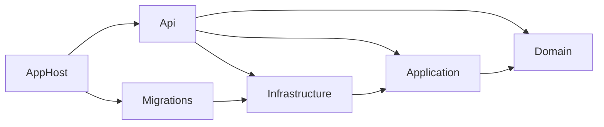
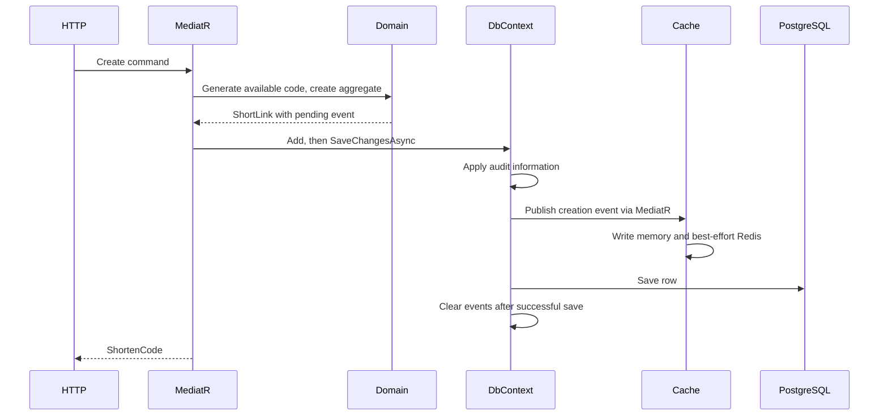
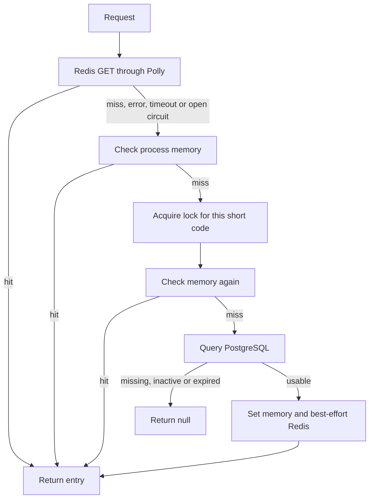

# UrlShortener tests and architecture

Verified on 2026-09-08: **18 unit tests + 47 integration tests passed** in Release,
with zero failures and zero skipped tests. The full solution Release build also
succeeded, including AppHost and Migrations. Coverage reports were generated.
Existing nullable initialization and migration-class naming warnings can still
appear during a clean compilation.

## Run the tests

Requirements: .NET 10 SDK and a running Docker engine configured for Linux containers.
The first integration run needs access to NuGet and the container registry.

From the repository root:

```sh
dotnet test test/UrlShortener.UnitTests/UrlShortener.UnitTests.csproj
dotnet test test/UrlShortener.IntegrationTests/UrlShortener.IntegrationTests.csproj
```

Run both test projects through the solution, and separately build all projects
(including Aspire and the migration executable):

```sh
dotnet test UrlShortener.slnx
dotnet build UrlShortener.slnx
```

Optional coverage:

```sh
dotnet test test/UrlShortener.UnitTests/UrlShortener.UnitTests.csproj --collect "XPlat Code Coverage"
dotnet test test/UrlShortener.IntegrationTests/UrlShortener.IntegrationTests.csproj --collect "XPlat Code Coverage"
```

Reports are written into each project's ignored `TestResults` directory. Docker
unavailability fails the integration run; tests are never silently skipped or
switched to an in-memory provider.

## Test organization

```text
test/
  Directory.Build.props                  Shared test package versions only
  UrlShortener.UnitTests/
    Domain/                              Aggregate creation, identity, events
    Application/                         Validation and persistence pipelines
  UrlShortener.IntegrationTests/
    Api/                                 HTTP creation, binding, 301/302 redirects
    Application/                         Domain service, MediatR and event flow
    Persistence/                         Migrations, repositories, audit, transactions
    Caching/                             Redis, memory, expiry, concurrency, resilience
    Support/                             Container fixture and real SQL observer
```

The integration fixture starts `postgres:17` and `redis:8.6.2` using the dedicated
Testcontainers modules. Ports are allocated dynamically. It hosts the actual API
with `WebApplicationFactory<Program>`, runs the checked-in EF migrations, and keeps
the production repository, unit of work, event dispatcher, Redis connection,
memory cache, keyed locker, and Polly pipeline registrations.

Tests in the shared collection execute sequentially and reset the test database,
Redis database, and process memory cache before every test. Each request uses its
own DI scope/DbContext. Containers have no production connection strings, fixed
names, host data volumes, or reuse setting, and are disposed after testing.

Resilience tests own a fresh factory and containers per test, so deliberate failures
cannot affect other tests. A real Redis `CLIENT PAUSE` exercises the 500 ms timeout.
Pausing/unpausing the Redis container exercises circuit opening, database/memory
fallback, skipped cache writes/removals, and successful half-open recovery. The
test retains the production 30-second break duration and uses bounded polling;
expect the integration suite to take roughly a minute on a warm local machine.
Container pause preserves the dynamically assigned endpoint during recovery.

`ShortLinkReadCounter` observes real EF SQL. It does not alter commands or return
fake results. Cache-hit tests assert zero database reads; 24 concurrent cold reads
of the same code must execute exactly one lookup. Redis TTL assertions tolerate
the intentional random jitter and small scheduling delays. Persisted timestamp
comparisons account for PostgreSQL's microsecond precision.

The only test double is a small private unit-of-work call recorder used to verify
pipeline ordering, commit/rollback/disposal, and exception propagation. There are
no PostgreSQL, Redis, repository, or cache doubles and no mocking library.

## What is built

This is a .NET 10 ASP.NET Core service with one business aggregate and two HTTP
operations. It uses MediatR 12, FluentValidation, Mapster, EF Core/Npgsql,
StackExchange.Redis, AsyncKeyedLock and Polly 8. Aspire starts PostgreSQL, Redis,
a migration executable, and the API; it waits for migration completion before
starting the API.

Project references:



`Infrastructure` also uses domain types through `Application`'s transitive
reference. `AppHost` orchestrates the processes; it is not in the request path.

## Aggregate and relationships

`ShortLink : AggregateRoot<Guid>` is the only concrete aggregate. There are no
child entities, concrete value objects, navigation properties, or foreign-key
relationships in the current model. Audit user IDs are scalar GUIDs; there is no
user aggregate or user table.

| Field | Meaning / persistence |
| --- | --- |
| `Id` | Application-generated UUID v7 primary key |
| `OriginalUrl` | Required; PostgreSQL maximum 2048 characters |
| `ShortCode` | Required; maximum 32 characters; unique case-sensitive index |
| `RedirectType` | Temporary = 302, Permanent = 301 |
| `ExpiresAt` | Optional UTC business expiration |
| `IsActive` | Set to true on creation; private setter |
| `MaxClicks` | Optional bigint; stored but currently not enforced |
| Audit fields | Creator/modifier GUIDs and creation/modification timestamps |

`ShortLink.Create` assigns identity and raises one `ShortLinkCreatedDomainEvent`.
The event contains link ID, code, URL, redirect type and expiry plus its own ID
and UTC occurrence time. Pending events are not mapped to PostgreSQL.

`ShortLinkDomainService` generates a seven-character code using the alphabet
`a-zA-Z0-9`, queries `IShortLinkRepository` for an existing code, and retries until
it finds an unused code. The factory itself does not validate business inputs.

## Services and request flow

| Component | Responsibility |
| --- | --- |
| `ShortLinksController` | POST `/api/v1/short-links`, Mapster mapping, returns 200 with `shortenCode` |
| `RedirectController` | GET `/{shortenCode}`, sends query and returns 301/302 with `Location` |
| `CreateShortLinkCommandHandler` | Calls domain service and stages the aggregate in the repository |
| `GetShortenUrlQueryHandler` | Resolves the cache entry; throws for unavailable codes |
| `ShortLinkRepository` | EF queries, add, update and remove |
| `UnitOfWork` / `EfTransaction` | Save changes and wrap EF transactions |
| `ShortLinkDbContext` | Mapping, audit values, event publication and persistence |
| `DomainEventBus` / `MediatrDomainEventDispatcher` | Wrap runtime event type in `DomainEventNotification<T>` and publish with MediatR |
| `ShortLinkCreatedDomainEventHandler` | Populates the short-link cache |
| `CurrentUser` | Reads the HTTP principal's `sub` claim |

MediatR's effective outer-to-inner behavior order is validation, exception logging,
transaction handling, then ordinary command saving. Ordinary commands save after
the handler. Transactional commands begin a transaction, execute the handler,
save, commit, and dispose; failure rolls back. Nested transactions defer to the
outer owner. Queries bypass both save and transaction creation.

Creation currently follows:



## Cache behavior

Despite the L1/L2 naming, the read order is **Redis first**, then process memory,
then PostgreSQL. Redis hits return immediately and do not populate memory.



- Redis keys are `short-link:{code}` with JSON values containing URL, redirect type
  and expiry. No-expiry links use a six-hour TTL. Expiring links use their remaining
  lifetime, without a six-hour cap. A random 0–10% reduction prevents the cache TTL
  extending beyond business expiry.
- Memory keys are `short-link:l1:{code}`. TTL is at most 30 seconds, shortened to
  remaining business lifetime. Memory entries use absolute expiration.
- A singleton keyed locker serializes cold lookup for the same code within one
  API process. A second memory check after acquiring the lock prevents duplicate
  positive database lookups. It does not coordinate multiple API replicas.
- Missing/inactive/expired database rows are not cached. Repeated misses can keep
  querying PostgreSQL; there is no negative cache.
- Invalid JSON and expired payloads are removed from Redis, then treated as a miss.
  A JSON `null` also behaves as a miss. URL/redirect-type validation of otherwise
  valid JSON is absent.
- Explicit cache `SetAsync` writes memory then tries Redis. `RemoveAsync` evicts
  memory then tries Redis. Redis failures are logged and swallowed; caller
  cancellation propagates.

## Circuit breaker

One named singleton Polly pipeline, `redis`, is shared across scoped cache services
and covers reads, writes and deletes together. It has a circuit breaker outside
a 500 ms timeout. Handled failures are `RedisException` and
`TimeoutRejectedException`. It uses a 10-second sampling window, minimum throughput
of five operations, failure ratio of 50%, and a 30-second open duration.

This is a ratio over the sample, **not five consecutive failures**. Successful
cache operations also count toward throughput. After opening, Redis calls are
rejected immediately. After the break duration a probe is allowed; success closes
the circuit and failure opens it again. There is no retry strategy in this pipeline.
The Redis wrapper uses `WaitAsync(token)`, allowing Polly to bound the wait even
though the underlying Redis command may still complete later.

## Findings and limits

The test suite verifies implemented behavior; it does not imply the service has
all production features. The following issues remain visible in the source:

1. **Cache publication precedes durable save/commit.** A unique-index failure or
   rolled-back transaction can leave an uncommitted URL in Redis and memory.
   Publishing only after `base.SaveChangesAsync` would still be too early for
   an explicit transaction. Resolve event publication at the successful commit
   boundary; use an outbox if durable delivery is required.
2. **Business validation is absent.** No concrete request validators exist.
   Malformed URL schemes, unsupported redirect values, past expiry and unsuitable
   click limits are not rejected by domain rules. HTTP binding validation catches
   malformed JSON and required null fields, but is not URL validation.
3. **Click limits are not implemented.** There is no click counter or atomic limit
   enforcement. `MaxClicks` only persists a value.
4. **Unavailable redirect errors are not mapped to HTTP status codes.** The query
   throws `InvalidOperationException`; the API has no exception middleware mapping
   that to 404/410. The exception behavior logs and rethrows.
5. **Cache invalidation is not tied to entity mutation.** Repository removal/update
   does not invalidate caches. The cache payload contains neither `IsActive` nor
   click state. Redis reads now reject expired payloads, but old or externally
   written valid JSON can still contain inactive links or invalid URL/redirect data.
6. **Generation has a concurrency race and no retry bound.** Existence checking
   and insertion are separate. The unique index protects data, but a competing
   insertion can fail without regenerating the code. The generation loop does not
   accept cancellation. Collision behavior is not forced with a fake repository;
   deterministic collision tests would need a small code-generator seam.
7. **Creation contract is misleading.** Request `shortCode` and `isActive` are
   ignored; the service generates a code and activates the link. The declared
   controller response type is an empty DTO, while the actual body is
   `CreateShortLinkCommandResponse`.
8. **The options-only DbContext constructor is migration-only in practice.** It
   leaves event and user services unset; calling its overridden save would fail.
   Tests use the real fully injected context. Existing nullable warnings remain.
9. Memory fallback does not repopulate Redis on a memory hit, even after Redis
   recovers. Redis is always attempted before memory. These are current design
   choices, with latency and recovery implications.

Deliberately excluded: load/soak testing, multi-replica lock behavior, generated-code
collision injection, durable event-delivery redesign, and unimplemented business
features. No tests are marked skipped to conceal these gaps.

## Small source changes made with the tests

- Fixed broken Domain project references in `Api.csproj` and `Application.csproj`,
  and API/migration project references in `AppHost.csproj`.
- Exposed `Program` as a public partial class for the API test host.
- Removed the duplicate transaction behavior registration and added a registration
  regression test.
- Fixed validation-context reuse, which duplicated errors across validators.
  Validation now awaits each validator with a separate context and forwards the
  cancellation token; tests cover multiple validators and asynchronous rules.
- Added an explicit expiry check when reading Redis. TTL alone could allow an
  expired payload to be returned. A regression test retains an expired payload
  with a long TTL and verifies eviction and PostgreSQL fallback.

No database/cache substitution or production timeout reduction was added.

## Reference documentation

- [Testcontainers PostgreSQL module](https://dotnet.testcontainers.org/modules/postgres/)
- [Testcontainers Redis module](https://dotnet.testcontainers.org/modules/redis/)
- [ASP.NET Core integration testing](https://learn.microsoft.com/en-us/aspnet/core/test/integration-tests?view=aspnetcore-10.0)
- [Polly circuit breaker](https://www.pollydocs.org/strategies/circuit-breaker.html)
